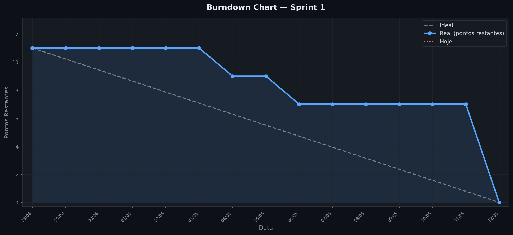
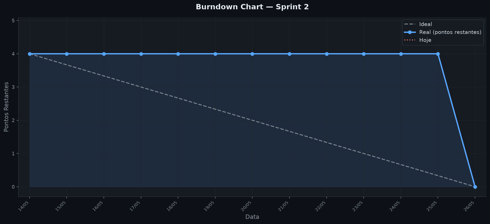

# CalculadoraEdenred

Plataforma de sustentabilidade para a Edenred que rastreia o impacto ambiental de transações digitais versus físicas, calculando métricas de redução de CO₂ por tipo de pagamento.

## Funcionalidades previstas

- Visualização do impacto ambiental por transação
- Visualização do progresso de sustentabilidade (árvore)
- Simulação de migração digital e gestão de cenários
- Exportação de relatório em PDF
- Cálculo por período personalizado

## Burndown

### Sprint 1 (28/04 – 12/05)
Burndown Sprint 1:


### Sprint 2 (14/05 – 26/05)
Burndown Sprint 2:


- [Burnup Sprint 1](https://github.com/orgs/root-2026-1/projects/2/insights/3): H1 e H2
- [Burnup Sprint 2](https://github.com/orgs/root-2026-1/projects/2/insights/6): H3 e H4
- [Burnup Sprint 3](https://github.com/orgs/root-2026-1/projects/2/insights/7): Épica
- [Burnup Sprint 4](https://github.com/orgs/root-2026-1/projects/2/insights/8): Últimos testes e correções de Bugs

## Tecnologias

- **Backend:** Java 17 + Spring Boot 3.5
- **Frontend:** React
- **Banco de dados:** PostgreSQL

## Pré-requisitos

- Java 17+
- PostgreSQL rodando localmente na porta 5432
- Node.js (para o frontend)

## Configuração do banco

Crie o banco de dados antes de rodar a aplicação:

```sql
CREATE DATABASE edenred;
```

## Configuração da aplicação

Crie o arquivo `src/main/resources/application.properties` com base no exemplo abaixo (este arquivo não é versionado):

```properties
spring.datasource.url=jdbc:postgresql://localhost:5432/edenred
spring.datasource.username=seu_usuario
spring.datasource.password=sua_senha

spring.jpa.hibernate.ddl-auto=update
spring.jpa.show-sql=true
```

## Como rodar o backend

```bash
./mvnw spring-boot:run
```

A aplicação sobe em `http://localhost:8080`.

## Como rodar o frontend

```bash
cd frontend
npm install
npm run dev
```

O frontend sobe em `http://localhost:5173`. O backend precisa estar rodando para as chamadas de API funcionarem.

## Estrutura do projeto

O backend segue arquitetura em camadas. O fluxo de dependências é unidirecional: **Controller → Service → Repository → Model**.

```
src/main/java/com/root/calculadoraedenred/
├── controller/       # Recebe requisições HTTP e delega ao service
├── service/          # Regras de negócio e validações
├── repository/       # Interfaces Spring Data JPA (acesso ao banco)
├── model/            # Entidades JPA persistidas no PostgreSQL
│   └── enums/        # PaymentType (PIX, NFC, WALLET, QR_CODE, PHYSICAL) e Period
├── dto/              # Objetos de transferência usados nas bordas da API
├── exception/        # GlobalExceptionHandler e respostas de erro padronizadas
└── config/           # CorsConfig e DataInitializer (seed de dados)
```

